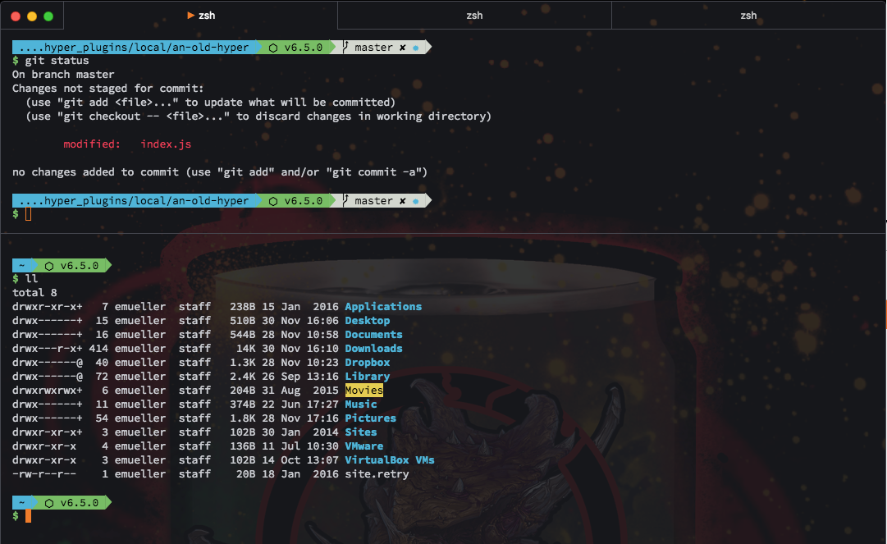

# An old Hype

[](https://circleci.com/gh/erikmueller/an-old-hype)

> Hyper theme inspired by a galaxy far far away...

Based on [An Old Hope](https://github.com/JesseLeite/an-old-hope-syntax-atom) - a splendid atom syntax theme by Jesse Leite

## Features

* __Transparent background__ - Opacity can be customized
* __Visible divider__ - lets you see where tiled terminals begin and end
* __6 theme styles to choose from__
    * `vader`
    * `yoda`
    * `threePO`
    * `r2`
    * `luke` (default)
    * `falcon`

## Settings

You can customize the __background opacity__ and the __style__ as well as the __active tab marker__.
To do so, provide a `themeSettings` object in the `config` property of your `~/.hyper.js`:

```js

config: {
    ...
    // Customize the theme
    themeSettings: {
        // Do not make background transparent (default is 0.6)
        opacity: 1,
        // Switch from luke's orange uniform to master yoda (check the available styles above)
        style: 'yoda',
        // Change the character that mars a tab active
        tabActiveMarker: '💁'
    },
    ...
}
```

## Screenshot



`oh-my-zsh` with the `pure` prompt and `Hasklig` font
